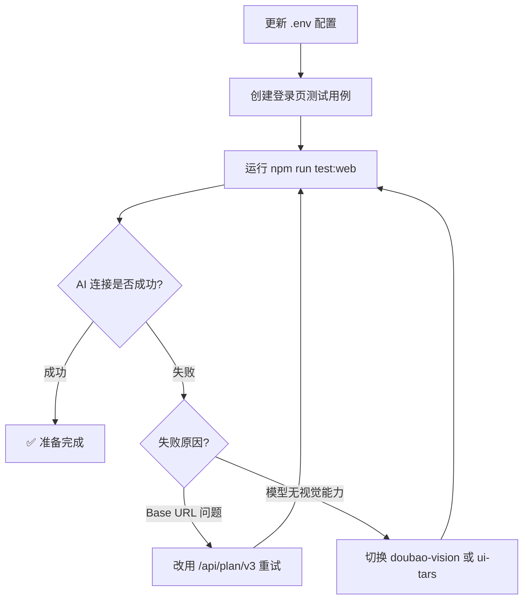

# 配置火山引擎 AI + 准备 40zhiyuan 登录测试

## 目标
1. 将 Midscene AI 模型配置切换为火山引擎 Doubao（`doubao-seed-2.0-code`）
2. 将测试目标 URL 指向 `https://40zhiyuan.com/login?redirect=/index`
3. 准备一个登录页的 AI 测试用例，验证 AI 连接与页面访问

---

## ⚠️ 技术风险提示

### 风险 1：Base URL 路径
- 用户提供：`https://ark.cn-beijing.volces.com/api/plan/v3`
- Midscene 使用 OpenAI 兼容接口，ARK 标准地址为 `https://ark.cn-beijing.volces.com/api/v3`（无 `/plan`）
- **方案**：采用标准地址 `/api/v3`。若运行报错再回退到用户提供的 `/api/plan/v3`

### 风险 2：模型视觉能力
- Midscene 必须把页面截图发给 AI，要求模型具备视觉（图像）理解能力
- `doubao-seed-2.0-code` 是否支持图像输入尚未完全确认
- **方案**：先按用户指定配置运行冒烟测试，若 AI 报错无法识别图片，则建议切换为 `doubao-1.5-vision-pro` 或 `ui-tars-1205`

---

## 实施步骤

### 步骤 1：更新 `.env` 文件
修改以下配置项：

```env
# 环境配置
ENV=dev

# Web 环境 URL —— 指向测试目标
WEB_DEV_URL=https://40zhiyuan.com

# ========================================
# Midscene AI 模型配置 —— 火山引擎 Doubao
# ========================================
MIDSCENE_MODEL_BASE_URL=https://ark.cn-beijing.volces.com/api/v3
MIDSCENE_MODEL_API_KEY=your-api-key-here
MIDSCENE_MODEL_NAME=doubao-seed-2.0-code
MIDSCENE_MODEL_FAMILY=doubao

# Midscene 可选配置
MIDSCENE_PREFERRED_LANGUAGE=Chinese
```

说明：
- 登录页完整 URL `https://40zhiyuan.com/login?redirect=/index`，在测试中通过 `environment.webUrl` + 路径拼接得到
- `MIDSCENE_MODEL_FAMILY` 设为 `doubao`（火山引擎豆包系列标识）

### 步骤 2：创建登录页测试用例
新建 `tests/web/login.spec.ts`，使用框架已有的 AI fixtures，先做一个最小冒烟测试：

```typescript
import { test, expect } from '../../src/fixtures/custom-fixtures';

test.describe('40zhiyuan 登录页 AI 测试', () => {
  test('登录页正常加载并包含登录表单', async ({ page, environment, aiAssert }) => {
    // 访问登录页
    await page.goto(`${environment.webUrl}/login?redirect=/index`);
    await page.waitForLoadState('networkidle');

    // AI 验证页面元素
    await aiAssert('页面上有登录表单');
    await aiAssert('页面上有用户名输入框和密码输入框');
  });
});
```

### 步骤 3：运行冒烟测试
```bash
npm run test:web
```
- 只运行 Web 测试（chromium-web 项目），避免移动端空目录报错
- 验证点：
  - AI 模型能否成功连接（最关键）
  - 页面能否正常加载
  - AI 断言能否执行

---

## 工作流程



---

## 涉及文件

| 文件 | 操作 |
|------|------|
| `.env` | 修改 AI 模型配置 + 测试 URL |
| `tests/web/login.spec.ts` | 新建登录页冒烟测试 |

不改动 `playwright.config.ts`、`src/` 下任何文件，保持框架稳定。
